# Admission System

To begin on your local machine, first install npm and node js https://nodejs.org/ (the .msi file installs both!)

Run 'npm install' command on the terminal in the directory where the files are present.

Make sure to replace the database credentials in the server.js with your credentials.

Refer HTML_Pages folder for preview of all the HTML pages

Login:
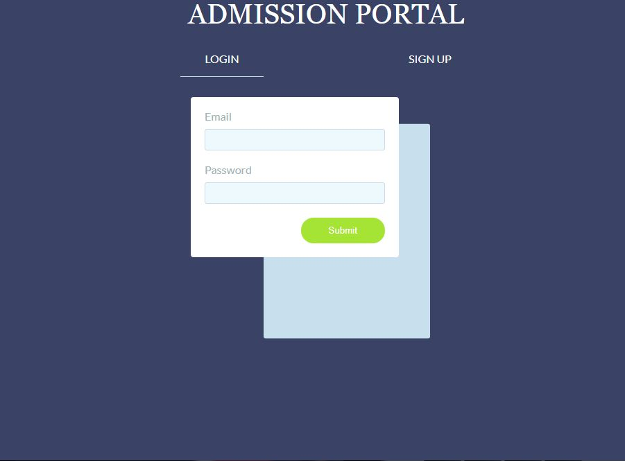

SignUp:
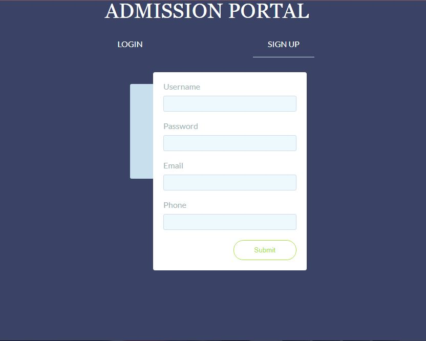

Dashboard Home:
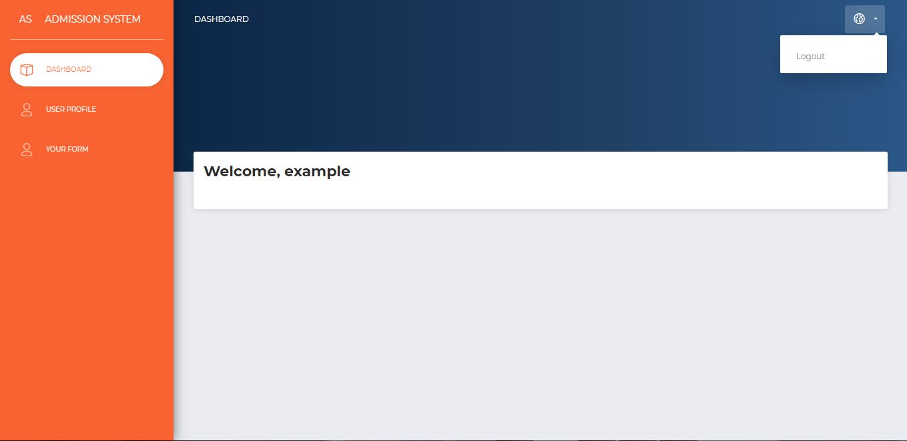

Profile Page:

Personal Info:
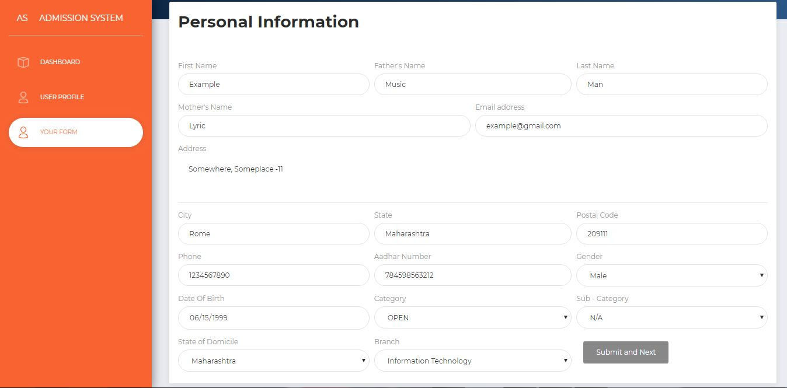

Academic Info:
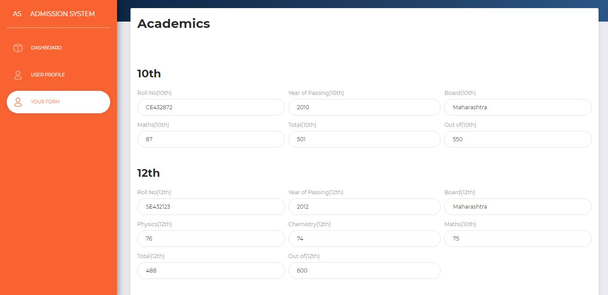

Bank Info:
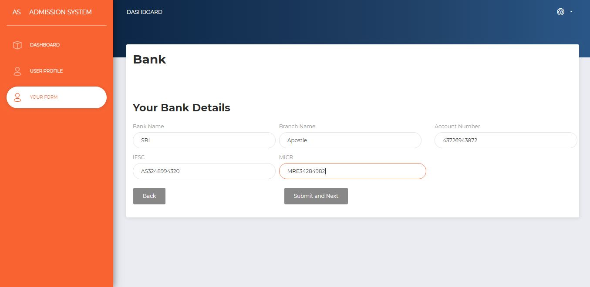

Parent Info:
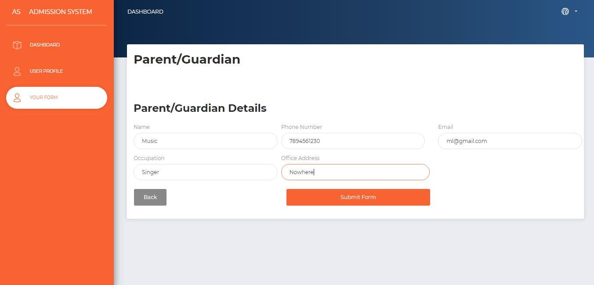

Admin Dashboard:
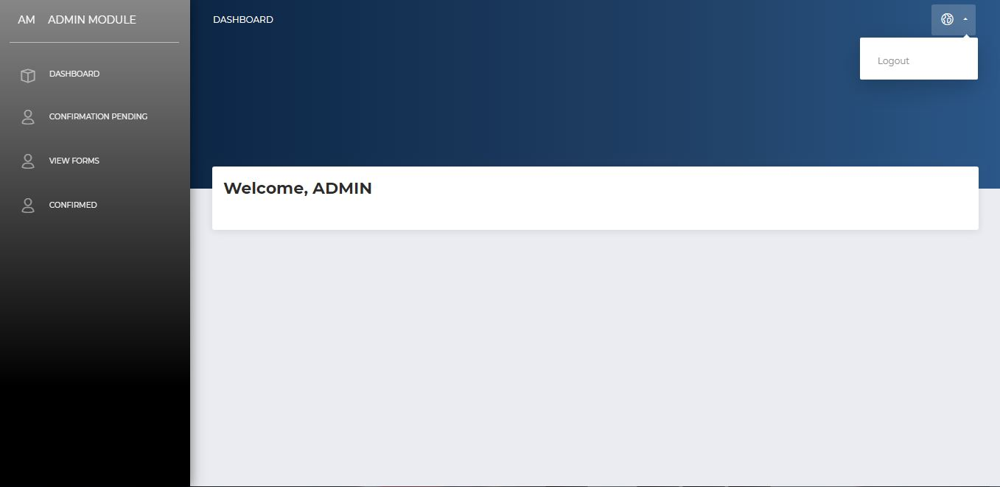

View:
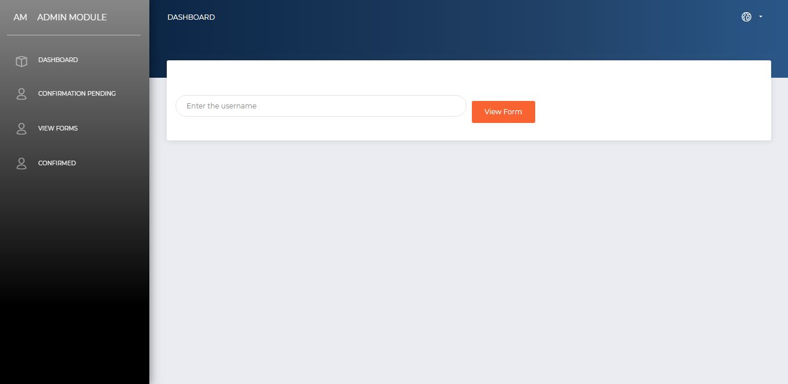
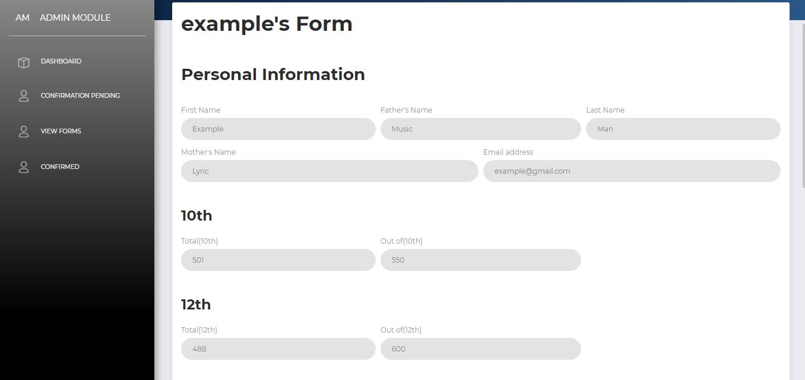
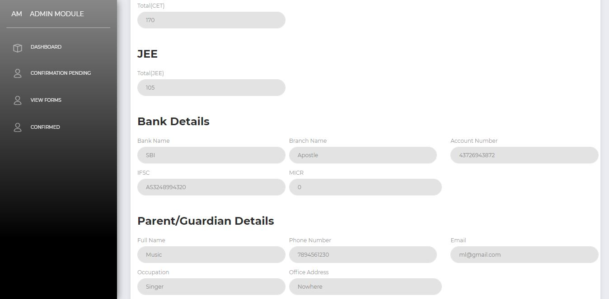

---
permalink: /index.html
---
